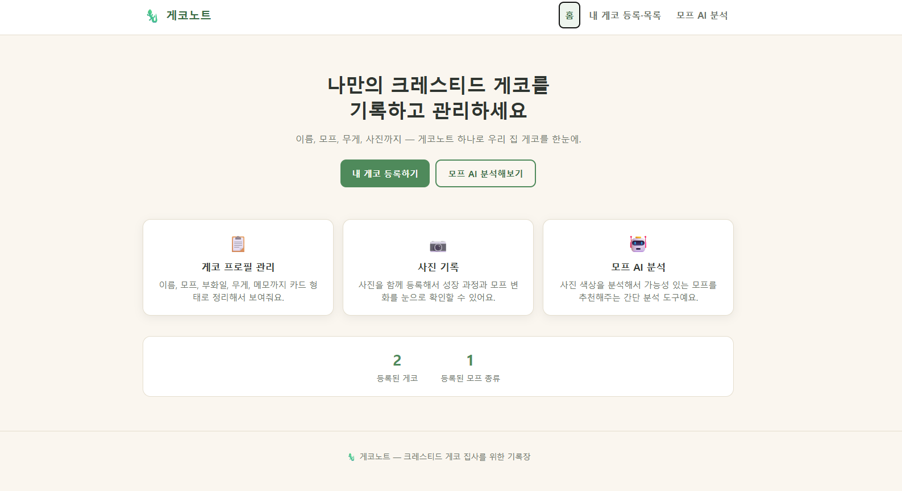
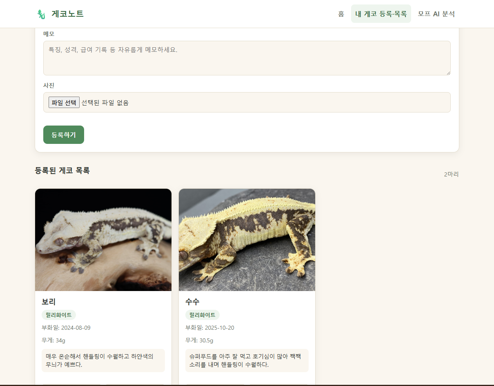
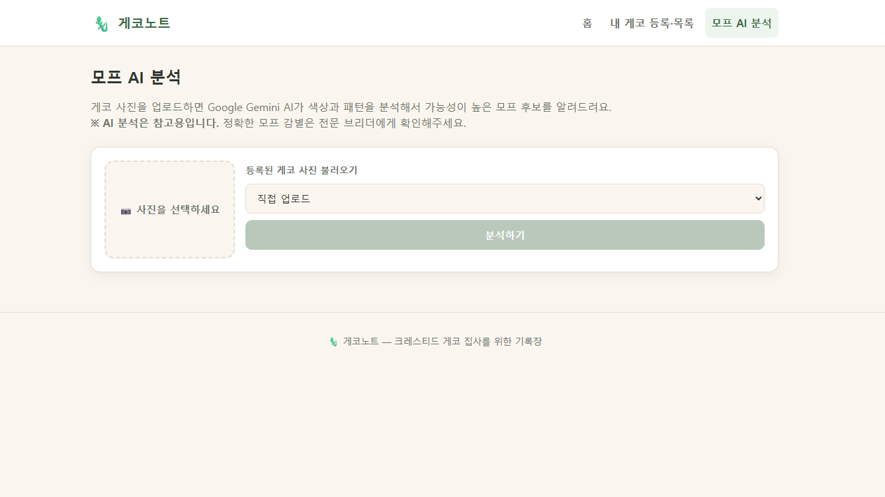

# 게코노트 (Gecko Note)

크레스티드 게코(크레스티드 게코, Crested Gecko)를 키우는 사람들을 위한 개인용 관리 웹 서비스입니다.
내가 기르는 게코들의 프로필(이름, 모프, 부화일, 무게, 사진, 메모)을 한곳에 기록하고,
사진 한 장으로 모프를 AI에게 물어볼 수 있도록 만들었습니다.

- **목적**: 여러 마리의 크레스티드 게코를 키우는 집사가 개체별 정보를 흩어진 메모/사진첩 대신
  한 화면에서 등록·조회할 수 있게 하고, 모프 감별에 대한 참고 의견을 빠르게 얻을 수 있게 합니다.
- **타겟 사용자**: 크레스티드 게코를 반려동물로 기르는 개인 브리더 및 애호가.
  별도 회원가입 없이 브라우저에서 바로 사용할 수 있는 가벼운 개인 기록 도구를 지향합니다.

## 페이지 구성

상단 네비게이션(모바일에서는 햄버거 메뉴)으로 이동하는 3개 화면으로 구성된 단일 페이지 앱(SPA)입니다.

1. **홈** — 서비스 소개, 주요 기능 카드, 등록된 게코 수/모프 종류 수 요약 통계
2. **내 게코 등록·목록** — 게코 등록/수정 폼과 등록된 게코들을 카드 형태로 보여주는 목록
3. **모프 AI 분석** — 사진을 업로드(또는 등록된 게코 사진 중 선택)하면 Gemini AI가 모프 후보와 근거를 분석해서 보여주는 화면

## 스크린샷

| 홈 | 내 게코 등록·목록 | 모프 AI 분석 |
| --- | --- | --- |
|  |  |  |

## 기술 스택

| 영역 | 기술 |
| --- | --- |
| 프론트엔드 | 순수 HTML / CSS / JavaScript (프레임워크·빌드 도구 없음) |
| 백엔드 | Vercel Serverless Functions (Python) |
| AI 모델 | Google Gemini API (Vision 지원 모델, `gemini-1.5-flash`) |
| 데이터 저장 | 브라우저 `localStorage` (게코 프로필/사진은 클라이언트에만 저장) |
| 배포 | Vercel |

## 핵심 기능

### 1. 게코 등록·관리 ([index.html](index.html), [js/main.js](js/main.js))
- 이름, 모프, 부화일, 무게(g), 메모, 사진을 입력해 게코를 등록
- 등록된 게코는 카드 목록으로 표시되며 수정/삭제 가능
- 모든 데이터는 `localStorage`에 저장되어 별도 서버 없이도 새로고침 후 유지
- 홈 화면에 등록 마리 수 / 모프 종류 수 통계 표시

### 2. 사진 기반 모프 AI 분석 ([api/analyze_morph.py](api/analyze_morph.py))
- 사진을 업로드하거나 등록된 게코의 사진을 선택해 분석 요청
- 프론트엔드가 이미지를 base64로 인코딩해 `POST /api/analyze_morph` 호출
- 백엔드가 Google Gemini Vision 모델에 이미지를 전달해 모프 후보(최대 3개), 신뢰도(%), 판단 근거, 전체 요약을 JSON으로 응답
- 참고용 분석이며, 정확한 모프 감별은 전문 브리더 확인을 권장한다는 안내 문구 포함

## 실행 방법 (로컬)

이 프로젝트는 [Vercel CLI](https://vercel.com/docs/cli)의 `vercel dev`로 프론트엔드와 서버리스 함수를 함께 로컬 실행하도록 구성되어 있습니다.

```bash
# 1. Vercel CLI 설치 (최초 1회)
npm install -g vercel

# 2. Python 의존성 설치
pip install -r requirements.txt

# 3. 환경 변수 설정 (.env 파일, 아래 "환경 변수 설정" 참고)

# 4. 로컬 개발 서버 실행
vercel dev
```

실행 후 안내되는 로컬 주소(기본값 `http://localhost:3000`)로 접속하면 됩니다.

## 배포 URL

배포 후 추가 예정

## 환경 변수 설정

모프 AI 분석 기능은 Google Gemini API 키가 있어야 동작합니다.

1. 프로젝트 루트에 `.env` 파일을 만들고 아래와 같이 키 이름만 설정합니다. (`.env`는 `.gitignore`에 포함되어 있어 저장소에 커밋되지 않습니다.)

   ```
   GEMINI_API_KEY=발급받은_API_키를_여기에_입력
   ```

2. Vercel에 배포할 때는 Vercel 프로젝트의 **Settings → Environment Variables**에 동일한 이름(`GEMINI_API_KEY`)으로 키 값을 등록해야 합니다. `.env` 파일은 배포 시 함께 올라가지 않습니다.

> ⚠️ 실제 API 키 값은 이 README나 저장소에 절대 커밋하지 마세요.

## 개발 과정

이 프로젝트는 AI 코딩 도구인 [Claude Code](https://claude.com/claude-code)와 함께 대화형으로 개발했습니다.

1. **정적 페이지 뼈대 구성** — "게코노트" 서비스 요구사항(홈 / 내 게코 등록·목록 / 모프 AI 분석 3메뉴, 모바일 반응형)을 전달해 순수 HTML/CSS/JS로 SPA 구조와 게코 등록·목록 CRUD(로컬스토리지 기반)를 우선 구현했습니다. 이 단계의 모프 분석은 실제 AI 없이 사진 평균 색상을 비교하는 간이 데모 로직이었습니다.
2. **실제 AI 분석 백엔드 연동** — 이후 `api/analyze_morph.py`를 Vercel Serverless Function(Python)으로 작성해 Google Gemini API와 연결하고, 프론트엔드의 색상 비교 로직을 실제 `fetch('/api/analyze_morph')` 호출로 교체했습니다. 사진 미입력/외부 API 오류에 대한 사용자 친화적 에러 메시지도 함께 반영했습니다.

앞으로도 기능 추가나 리팩터링은 Claude Code와의 대화를 통해 반복적으로 진행할 예정입니다.


